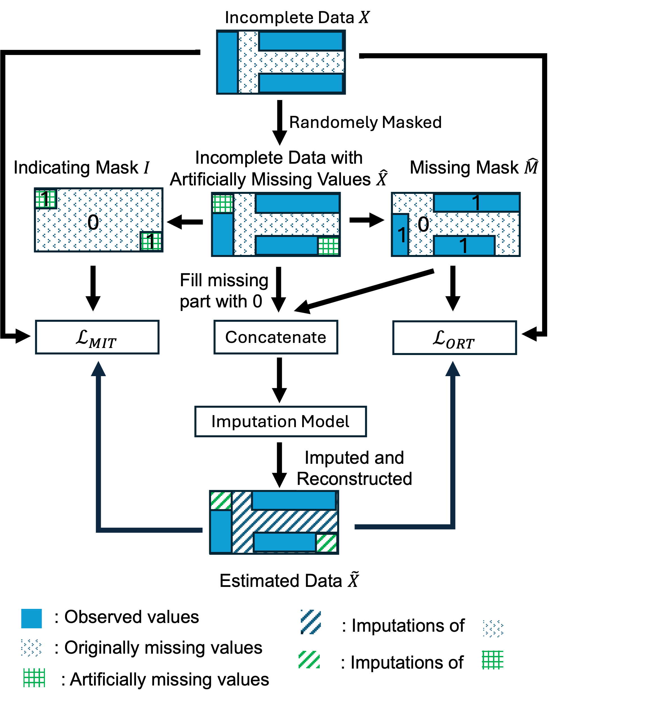
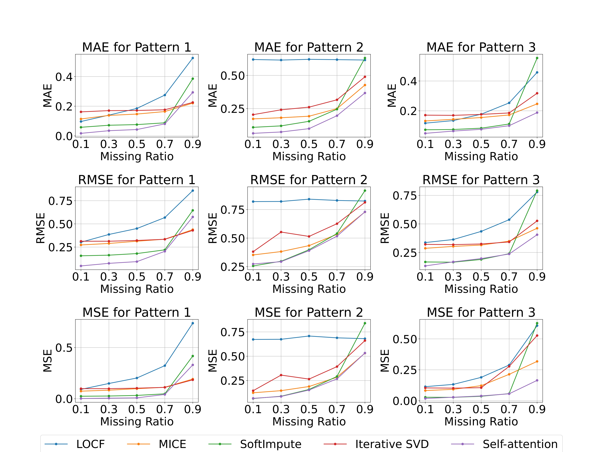
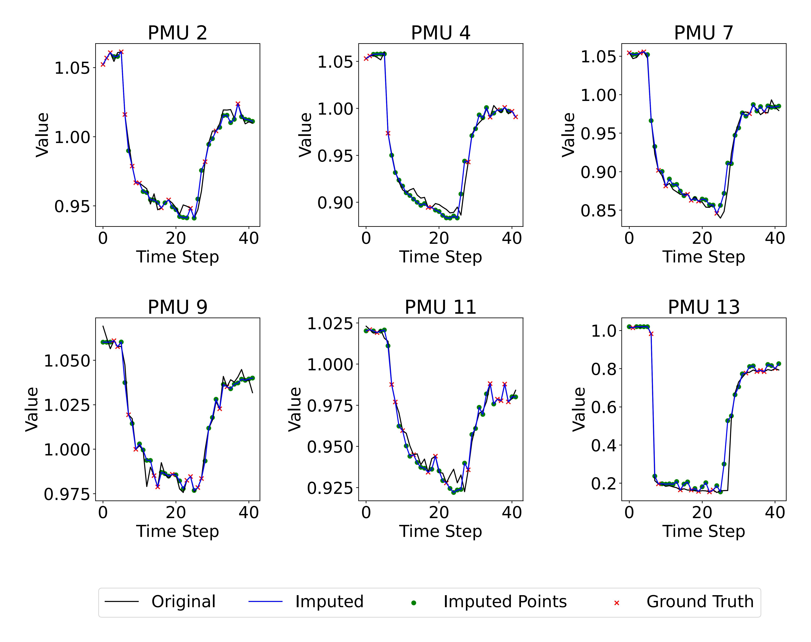

# Robust Noisy PMU Data Recovery with Self-Attention

This repository contains the implementation for the paper:

**"Robust Noisy PMU Data Recovery in Transient Conditions through Self-Attention Neural Networks" (ISGT Conference 2024)**  
📄 Published in [IEEE ISGT 2024](https://ieeexplore.ieee.org/document/10863227)

## 📖 Overview
The notebook [`Imputation.ipynb`](notebooks/Imputation.ipynb) includes:
- Data preprocessing
- Generation of missing data patterns
- Self-Attention-based imputation
- Benchmark comparison (LOCF, MICE, SoftImpute, Iterative SVD)
- Evaluation metrics (MAE, RMSE, MSE)

## 🔧 Setup

Clone the repo and install dependencies:

```bash
git clone https://github.com/rbahmani01/times_series_imputation_power_system_voltage_data.git
cd times_series_imputation_power_system_voltage_data
pip install -r requirements.txt
```

## 📂 Dataset

The dataset used in this project is based on IEEE 39-bus simulations and is around **2 GB** in size.  
Due to size limitations, it is **not included in this repository**.

➡️ The dataset can be provided upon request.  

## 🚀 Run the notebook
Open Jupyter and run the main notebook:

```bash
jupyter notebook notebooks/Imputation.ipynb
```

## 📐 Methodology

The proposed method employs a **joint-optimization training strategy** that combines:
- Masked Imputation Task (MIT)
- Observed Reconstruction Task (ORT)

<p align="center">
  
</p>

## 📂 Missing Data Patterns

We considered **three missing data patterns** in PMU signals:
1. **Random missing values**  
2. **Consecutive missing sequences**  
3. **Block/global missing due to communication or GPS failures**

<p align="center">
  
</p>

## 📊 Results

Our proposed **Self-Attention Imputation** is compared against:
- LOCF  
- MICE  
- SoftImpute  
- Iterative SVD  

Across **different missing ratios (0.1–0.9)** for all three patterns.  
We report **MAE, RMSE, and MSE**.

<p align="center">
  
</p>

### 🔎 Case Study: Reconstructed Signals

Example recovery of **voltage magnitude signals** for multiple PMUs under noisy and missing data conditions.  

<p align="center">
  
</p>

## 📖 Citation
If you use this code, please cite our paper:

R. Bahmani, M. Afrasiabi  
**"Robust Noisy PMU Data Recovery in Transient Conditions through Self-Attention Neural Networks,"**  
*IEEE ISGT Conference 2024*.  
[https://ieeexplore.ieee.org/document/10863227](https://ieeexplore.ieee.org/document/10863227)

```bibtex
@inproceedings{bahmani2024pmu,
  author={Bahmani, Ramin and Afrasiabi, Mousa},
  title={Noisy PMU Data Recovery in Transient Conditions through Self-Attention Neural Networks},
  booktitle={2024 IEEE PES Innovative Smart Grid Technologies Europe (ISGT Europe)},
  year={2024},
  publisher={IEEE},
  doi={10.1109/ISGTEUROPE62998.2024.10863227},
  address={Dubrovnik, Croatia},
  month={Oct}
}
```

## 📜 License
MIT License (or CC-BY-4.0 depending on funding requirements).
